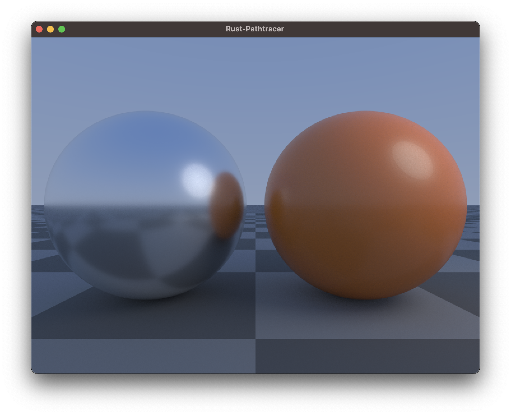

This is a port of the excellent [GLSL_Pathtracer](https://github.com/knightcrawler25/GLSL-PathTracer) to Rust utilizing an abstracted, trait based backend. Perfect for rendering procedural content.



### Rust Features

* Multi threaded using [rayon](https://github.com/rayon-rs/rayon).
* An abstracted backend via a scene description trait. Implement hit tests, lights and materials for your procedural content.
* The pathtracer can be compiled to either ```f32``` or ```f64```. See the defines in the ```libs.rs```. Default is ```f64``` for now.

### Todo

* Support of mediums / volumetric objects.
* Implement a denoiser.
* Emitters are untested right now.
* Only spherical analytical lights right now.
* Document classes for crate.
* Implement a SDF based example scene.
* Implement a mesh based example scene. PRs welcome.
* Enhance the example renderer app with more options.
* More testing.

### How to use

```rust
// Create a color buffer
let mut buffer = ColorBuffer::new(800, 600);

// Create a scene and pass it to the path-tracer
let scene = Box::new(AnalyticalScene::new());
let mut pt = Tracer::new(scene);

// Render and accumulate one frame, repeat
pt.render();
```

You can copy the color buffer into an ```Vec<u8>``` by calling ```     buffer.convert_to_u8(frame);``` or you can access the float pixels directly by accessing ```buffer.pixels```.

### Scenes

Scenes contain objects, lights, the background and material definitions.

The scene trait is pretty small right now.

```rust
pub trait Scene : Sync + Send {

    fn new() -> Self where Self: Sized;

    /// Background color for the given ray
    fn background(&self, ray: &Ray) -> F3;

    /// Closest hit should return the state.hit_dist, state.normal and fill out the state.material as needed
    fn closest_hit(&self, ray: &Ray, state: &mut State, light: &mut LightSampleRec) -> bool;

    /// Used for shadow rays.
    fn any_hit(&self, ray: &Ray, max_dist: F) -> bool;

    /// Return the camera for the scene
    fn camera(&self) -> &Box<dyn Camera3D>;

    /// Return the number of lights in the scene
    fn number_of_lights(&self) -> usize;

    /// Return a reference for the light at the given index
    fn light_at(&self, index: usize) -> &AnalyticalLight;
}
```

The analytical example scene which creates the above screenshot can be found inside the renderer [here](https://github.com/markusmoenig/rust-pathtracer/blob/master/renderer/src/analytical.rs).

### Renderer

The repository contains an example renderer which displays the ongoing rendering process. You can easily run it with ```cargo run --release```. The renderer will be enhanced with additional features soon (write images to disk, display a frame counter etc).

### CPU vs GPU: Motivation

I prefer to render SDFs on the CPU. Of course the GPU is faster and there are many great Shadertoy demos, however when the SDF complexity of a scene is user defined and you do not know the OS or GPU of the user, one of these things can happen:

* Shaders take seconds to compile and depending on the platform can freeze your app while doing so.
* Shaders can run so slow that they make your app hard to use.
* In the worst case shaders can crash.

The CPU renders slower but does not need to compile shaders and render tasks can be nicely handled in the background without affecting the overall performance of the app.
